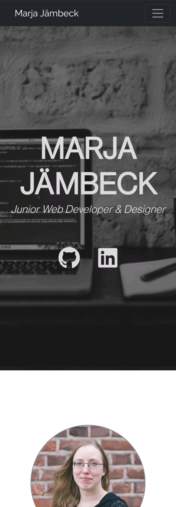
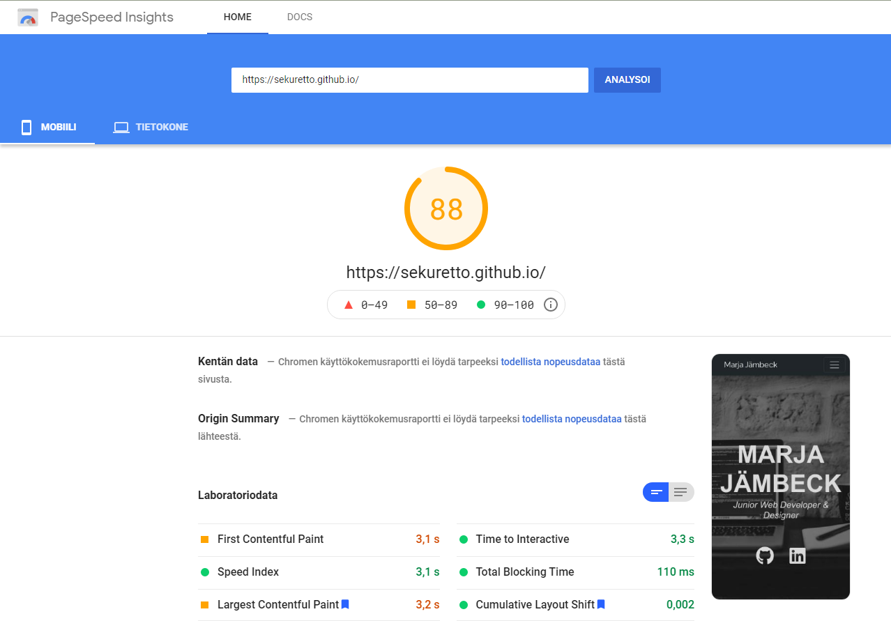

# Harjoitustyö  
## Web-portfolion päivitys

Alkuperäinen portfolioni (https://sekuretto.github.io/) kaipasi päivitystä, joten otin sen harjoitustyöni aiheeksi. Olen toteuttanut aiemman portfolio-sivun myös Bootstrapilla, mutta käyttäen valmista, ilmaista Bootstrap portfolio teemaa [Stylish Portfolio](https://startbootstrap.com/theme/stylish-portfolio), jonka rakennetta olin vain muokannut ja lisännyt sivulle oman sisältöni. Halusin tässä harjoitustyössä korvata tämän vanhan portfolion, ja oman oppimisen sekä osaamisen näytön kannalta luoda sivupohjan Bootstrapilla ja muilla webtekniikoilla nyt alusta loppuun ihan itse. Sivun sisällön ja kokonaisrakenteen pidin kuitenkin pääosin samana kuin aiemmassa portfoliossa. Olen tähän asti pitänyt käyttämäni teeman sivurakenteesta, joten halusin mukailla ja matkia sitä myös nyt sivua uusiessani. Mutta nyt harjoitustyön yhteydessä aioin ja pystyin pohtimaan paremmin sivuston eri osien rakennetta, visuaalisuutta ja toimivuutta; erityisesti tiettyjen sivu-osioiden ulkonäköä ja toimivuutta siinä tarkoituksessa, että käytän sivua työnhaussa portfoliona ja mainontana omista taidoistani. Halusin työssä harjoitella myös erityisesti Sassin käyttöä, sekä mahdollisesti myös Google Material Designia.  

Screenshot alkuperäisestä portfoliosta (mobiili-versio):  
  
  
Screenshot uudesta portfoliosta (mobiili-versio):  
  

Alkuperäisen portfolioni lähdekoodi on nähtävissä [Githubin repositoriossani](https://github.com/sekuretto/sekuretto.github.io) kansiossa old_portfolio.  

Koska saatan dokumentaatiossa viitata useaan otteeseen sivun eri osioihin ja kertoa niiden kehityksestä, lyhyenä selvennöksenä uuden portfolion sivurakenne on siis seuraavanlainen:  
- navigaatio (navbar)  
- header/showcase  
- varsinainen sivun sisältö jaettuna section-elementteihin:  
  - About (oma henkilökuvaukseni)  
  - Skills (osaamani teknologiat kuvauksineen, Flexbox/Grid)  
  - Portfolio/Projektit (varsinainen portfolio tekemistäni projekteista, Grid)  
  - Image Gallery tai muut mahdolliset osiot sivujen laajentumista varten
  - Contact (yhteystiedot)  
- footer  

Vanha portfolio tosiaan seurasi tätä samaa rakennetta.

## Resursointi (ajankäyttö)

Websivun koko rakenteen suunnitteluun ja sisältöön minun ei juuri tarvinnut käyttää aikaa, koska tosiaan hyödynsin pohjana jo aiempaa portfolio-sivuani. Käytin kuitenkin Figmaa, sekä Web-visualisointi -kurssin WV-H7 ja WV-H10-tehtäviä hyödykseni pohtiessani mitä muutoksia nyt tekisin sivun rakenteeseen tai ulkonäköön. Siksi minulla oli työtä aloittaessa jo aika selkeä kuva sivun rakenteesta sekä ulkonäöllisesti että HTML:n semanttisen rakenteen kannalta, joten aikaa ei kulunut työn aikana niin paljon erinnäiseen sivurakenteiden asettelujen testailuun tai ulkonäkövalintojen mietintään kuin olisi voinut kulua, jos olisin lähtenyt liikkeelle aivan tyhjästä ja ilman aiempaa sivuversiota. Lisäksi työtäni siivitti se, että halusin saada sivun julkaistavaan kuntoon mahdollisimman nopeasti, jotta voisin käyttää sitä työnhaun apuna ja taitojen näytteenä mahdollisimman nopeasti vanhan sivuversion tilalla.    

Kokonaisuudessaan harjoitustyön tekoon kului noin kuukausi, kun tein sitä muun koulutyön ja töidenhaun ohessa. Välillä omistin harjoitustyön teolle kokonaisen työpäivän kerrallaan ja vielä illallakin innostuttuani koodaamaan tai kirjoittamaan sisältöä. Välillä taas tein työtä muutaman tunnin kerrallaan eri päivinä.

Tarkemmin eriteltynä harjoitustyön rakenteluun kului noin pari viikkoa, jos mittaan työskentelyäni karkeasti työpäivinä (n. 6h päivässä). Sivun perusrakenteen koodaamiseen Bootstrapin elementtien avulla ja vanhaa portfoliota mukaillen meni yhteensä noin neljä päivää. Pääosa tästä eli noin pari päivää meni pelkästään sivun sisällön tuotantoon ja muokkaamiseen ja media queryjen viilaamiseen. Samalla kaiken koodailun rinnalla tein alusta asti myös työn dokumentointia kirjoitellen muistiinpanoja työn eri vaiheista ja etenemisestä. 

Merkittävin uudistunut osio ja siten kehitystyön vaihe oli sivujeni Skills-osio, jonka suunnitteluun ja Grid-rakenteen rakenteluun ja säätelyyn kului kaksi päivää, mukaanluettuna sisällöntuotanto.  

Aloitin harjoitustyön ensin tekemällä sivun tyylimäärittelyt pelkästään Bootstrapin omilla tyyleillä, joita muokkailin tarpeellisissa kohdissa omalla CSS:llä. Kun sivun rakenne ja sisältö alkoi olla kasassa, otin tässä vaiheessa käyttöön myös Sassin harjoitellakseni sen käyttöä. Yksi päivä kului kokonaisuudessaan siihen, kun muunsin kaiken siihenastisen sivulla käyttämäni oman CSS:ni Sassiksi, josta sitten käänsin sivulle uuden tyylitiedoston. Tässä vaiheessa työ alkoi olla pääpiirteissään ja sisällöltään jo valmis, ja julkaisin sivun Githubin pagesissa. Harjoitustyönä jatkoin silti sivun ja Sassin viilailua vielä suunnilleen kaksi päivää, pohtien ja testaillen Sassilla vielä sivun asetteluja ja korjaillen pikkuvirheitä. Toinen päivistä kului vielä pelkkään media queryjen lisäilyyn ja villaamiseen, jotta sain sisällön ja varsinkin kuvat asettumaan hyvin myös pienillä puhelimennäytöillä.  

Viimeisenä kulutin vielä useamman päivän (3-4 päivää) kirjoittaen kuntoon ja valmiiksi harjoitustyön dokumentaatiota. Samalla korjailin vielä sivun ja kuvien responsiivisuutta ja grafiikan optimointia, ja testailin sivun Pagespeed-tuloksia. Kun siis lasken yhteen nämä karkeat työpäivät, kului harjoitustyön tekoon suunnilleen 14 päivää.

## Teknologiavalinnat perusteluineen

### Bootstrap
Käytin harjoitustyössä Bootstrapin sillä hetkellä uusinta versiota (v5.0.0-beta2). Uusimman version käyttäminen tarkoitti totta kai, että minulla oli käytettävissäni uusin Bootstrapin dokumentaatio sivujen rakentamisen apuna, ja sivut pysyvät myös pitempään yhteensopivina ja vakaina. Latasin Bootstrapin lähdetiedostot ja kopioin Bootstrapin päätiedoston bootstrap.min.css sivujen CSS-kansioon, josta Bootstrap-tyylit siis ladataan oman tyylitiedostoni kanssa. Luonnollisesti täytyi kopioida myös Bootstrapin käyttämä JavaScript-tiedosto lähdetiedostoista. Mutta käyttäen näitä kutistettuja lähdetiedostoja suoraan omasta sivustorakenteestani ja samalta palvelimelta, pyrin siihen ettei sivujen latautumiseen tulisi minkäänlaista viivettä tai kaatumisen riskiä kuin voisi olla jos käyttäisin Bootstrapia pelkän CDN-linkin kautta.   

Otin siis Bootstrapin elementteineen työhöni mukaan jo alusta asti, ja rakensin sivujen perusrakenteen sillä ja sen elementeillä, sekä myös HTML:n semanttisella rakenteella. Omalla CSS:llä ja Sassilla lähdin sitten muokkaamaan käyttämiäni Bootstrapin elementtejä niiltä osin kuin tarvetta ilmeni, ja lisäsin myös omaa toiminnallisuutta elementteihin. Lisäksi hyödynsin Bootstrapin omia tyylejä ja classeja omien sivuelementtieni tyylien pohjana, millä tavoin sain vähennettyä kirjoitettavan CSS:n määrää. Mikä osaltaan taas vähensi päällekkäisten tyylimääritysten määrää ja selaimen turhaa tyylien ylikirjoittamista.  

### Flexbox/Grid  

Hyödynsin Flexboxia ja Gridiä tarpeen mukaan.

Flexboxia on hyödynnetty Skills-osion card-elementtien otsikoiden ja tähtien asettelussa, sekä social-link ikonien asettelussa, jotta ne on saatu aseteltua samalle riville siististi.  

Gridiä hyödynsin sekä Skills- että Portfolio-osioiden korttien asettelussa, jotta niiden koko ja asemointi skaalautuu hyvin eri näyttökoossa media queryjen mukaan.

### Selaintuki & skaalautuvuus

Bootstrap v5.0 ei tue Internet Explorer-selainta, mutta tukee IE:n korvaavaa Edgeä. Koska IE on tosiaan vähitellen poistumassa historiaan, eikä sen käyttöä enää edes suositella, totesin tämän harjoitustyön kannaltakin että selaintuki IE:lle tuskin enää on tarpeellinen.  

[Bootstrap v5.0](https://getbootstrap.com/docs/5.0/getting-started/browsers-devices/) tukee mobiilissa Androidin osalta Chromea, Firefoxia ja Android-selainta/WebViewtä. Desktopissa tukee Windowsin osalta Chromea, Firefoxia, Microsoft Edgeä ja Operaa. Koin että jos huolehdin skaalautuvuudesta ja selaintuesta ainakin näille selaimille ja alustoille, erityisesti Chromelle, Firefoxille ja Edgelle sekä mobile-versiona Androidille, se olisi riittävä selaintuen laajuus. Sivujen kehitystyön tein Chromella, mutta testasin sivujen toiminnan ja skaalautuvuuden myös Microsoft Edgellä (versio 89.0), Mozilla Firefoxilla (versio 87.0) sekä puhelimellani (OnePlus8/Chrome).  

Tarkoitukseni oli alunperin lähteä tekemään sivuja mobile first-periaatteella siten, että sivut skaalautuvat ja CSS on suunniteltu ensisijaisesti mobiililaitteen ruuduille. Ja olisin käyttänyt media queryjä CSS:ssä skaalaamaan sivut sitten isommille näytöille. Käytännössä totesin kuitenkin, että oli järkevämpi tehdä skaalautuvuus toisinpäin, eli suunnittelin ja toteutin sivut ensin desktop-koossa, koska ajattelin että todennäköisempää ehkä kuitenkin on että portfolio-sivuja katsotaan työnantajien ja rekrytoijien toimesta ensisijaisesti kunnon tietokoneen näytöiltä. Ja koska sivuillani on yllättävänkin paljon tekstisisältöä, se myös asemoituu siistimmin isolla näytöllä. Vasta desktop-tyylien oltua kunnossa lähdin skaalaamaan sivun sisältöä ja tyylejä pienemmille näytöille. Erityisesti otin skaalautuvuudessa huomioon gridit, ja sen että niiden sisältö ei alkanut näyttää ruudussa liian ahtaalta ja kapealta. Loin media breakpointteja myös reilusti enemmän kuin vain yleisimmät breakpointit, sillä halusin erityisesti sisällön leveyden ja yhden kuvista (About-osion omakuva) skaalautuvan ja asemoituvan nätisti minkäkokoisella näytöllä tahansa. Chromen Developer Tools oli siis skaalautumista säätäessä erityisen kovassa käytössä.  

### Git (pages) / Github  

Sivut on harjoitustyönä julkaistu JAMK Gitlabiin, josta niitä voi Pagesin avulla käyttää suoraan verkkosivuna. Sivujen toteutukseen käytin Git-versionhallintaa suoraan konsolista ja koodin sekä dokumentaation kirjoittamiseen käytin Visual Studio Codea.   

Sivut on julkaistu myös [Githubiin](https://github.com/sekuretto/sekuretto.github.io) github-pagesin päälle entisen version tilalle. Tein itse asiassa pääasiallisen kehitys- sekä julkaisutyön sivuille Githubissa, joten Gitlabiin julkaistu sivu on sama versio tästä.   

### SASS  

Päätin pyrkiä käyttämään Sassia harjoitustyössä harjoitellakseni lisää sen käyttöä, ja koska jo Sassia harjoitellessa pidin sen visuaalisesta hierarkisesta rakenteesta. Mielestäni mahdollisuus kirjoittaa Sassissa CSS:ää sisentämällä (nesting) auttaa paljon CSS:n ja tyylimääritysten periytymisen ymmärtämisessä.  

Käytin Sassia asentamalla koneelle Node.js:n, ja Visual Studio Codella npm:n, jolloin saatoin asentaa ja käyttää Sassia suoraan Visual Studio Coden omasta konsolista. Tämä oli käytettävyydeltäänkin ehdottomasti paras ja vakain tapa käyttää Sassia, koska olin Web-visualisoinnin H8-tehtävässä kokeillut myös Visual Studio Coden -lisäosaa Live Sass Compiler, joka ajoi sekin kyllä asiansa mutta oli silti epävakaampi ja altis kaatumaan koska ilman terminaali-ikkunaa sen koodinseurantaa ei meinannut muistaa pysäyttää jos vaikka poisti Sass-tiedostoja, joka sitten aiheutti lisäosan kaatumisen.  

Kuva Sass-kehityksestä npm:n avulla Visual Studio Codesta:
  
Kuvasta näkyy myös, että kehitin sivua ja harjoitustyötä tosiaan Githubin repositorioon alikansiossa [dev_portfolio](https://github.com/sekuretto/sekuretto.github.io/tree/master/dev_portfolio). Tämän kansion kopioin Gitlabiin harjoitustyöksi.  

Jaoin Sass-tiedostoni seuraavalla tavalla:  
- style.scss: päätiedosto josta CSS käännetään, sisältää perus tyylit nav ja header(showcase) -osioiden tyyleille, sekä eri section -osioiden tyyleille  
- _config.scss: konfiguraatio-tyylit eli fontit ja muuttujat väreille  
- _gridcard.scss: sisältää tyylit grid-muotoiluille korttialueille (Skills & Projects) sekä itse korteille  
- _media.scss: kaikki media queryt  

Koin Sassin hyödyllisyyden tämän laajuisen websivun rakentamisessa ehkä vielä vähän laihaksi. Sassin harjoittelun ja ymmärtämisen kannalta se ehdottomasti oli hyödyksi, ja sain kuitenkin harjoiteltua muuttujien ja importtien, vähän jopa extendien käyttöä sekä tietenkin Sassin hallintaa yleisesti. Tämän laajuisessa työssä kuitenkaan ole ehkä ihan niin merkittävästi CSS:ää, että muutoin olisi käyttöhyötyä siitä että käyttää Sassia ja pilkkoo CSS:ää sen sijaan että olisi vain käyttänyt tavallista CSS:ää. Ehdottomasti sain kuitenkin hyvää harjoitusta ja varmuutta Sassin käyttöön, ja tämän jälkeen käytän sitä mielelläni missä tahansa muussakin webprojektissa jos vain mahdollista.  

Pohdin Sassin muokkaamisen yhteydessä myös sitä, että Bootstrapin lähdekoodinkin olisi voinut asentaa npm:n kautta ja päästä sitä kautta käsiksi ja muokkaamaan Sassilla suoraan myös vaikka Bootstrapin värejä ja muuttujia, kuten [Bootstrapin omasta dokumentaatiosta](https://getbootstrap.com/docs/5.0/customize/sass/) näkyy. Näin olisin ehkä voinut rakentaa suoraan Bootstrapin pohjalta sivuilleni oman custom Sassin, sen sijaan että Bootstrap ja oma CSS/Sassini ovat nyt erillään. Pohdin kuitenkin että koska sivuni on vain portfolio-sivu eikä siksi laajuudeltaan mitenkään iso, olisi tälläinen Bootstrapin suora kustomointi ehkä turhan työläs kokeilu sivujeni kokoon nähden. Ei toki ole poissuljettua, että jos vielä kehitän sivujani, että myöhemmin kokeilisin Bootstrapin kustomointia vielä.  

### Visuaalisuus ja siihen liittyvät valinnat perusteluineen  

Sivun visuaalisuus ja värimaailma määräytyi pitkälti otsikkokuvan (pexels-negative-space-169573.jpg) pohjalta, joka on Pexels -kuvapankkipalvelusta jo aiempaan portfolioversioon etsimäni ja siellä käyttämäni kuva. (Kuvan alkuperäinen sijainti: https://www.pexels.com/fi-fi/kuva/apple-etatyo-kannettava-tietokone-koodaus-169573/) Valitsin kuvan aikanaan, koska pidin sen neutraalista harmaasta/tummasta värimaailmasta ja kuvan aihe läppäreineen, muistikirjoineen ja kahvikuppeineen oli ammattimaisen oloinen ja kuvasi mielestäni hyvin IT-alan opiskelijan elämää portfoliokuvana. Käytän kuvaa sivuillani siis ns. hero imagena sivun pääotsikon eli nimeni taustana. Käytin apuna myös W3Schoolsin How To -opasta [Hero Imagen](https://www.w3schools.com/howto/howto_css_hero_image.asp) teosta, ja tummensin kuvaa hieman lisää jotta sen päällä oleva teksti erottuu selvemmin. Käytin kuvan päällä olevassa pääotsikko-tekstissä myös hieman pehmeämpää valkoista väriä (#dadada) kuin puhdasta valkoista, joka erottuu kuvasta hyvin mutta ei kuitenkaan "loista" silmiä rasittavasti tumman kuvan päällä. Kuvaa mukaillen halusin käyttää sivulla myös pääasiallisesti Bootstrapin tummaa teemaa, josta tuli navigaatiopalkin väri.  
Sivujeni pääväreiksi muodostui siis lopulta Bootstrapin oma Dark-teemaväri (#212529), valkoinen (#ffffff) sekä pehmeä valkoinen (#dadada). Koska nämä värit toistuvat kauttaaltaan koko sivulla, se tuo mielestäni sivuun myös yhtenäisyyden tuntua.

Hain kaikessa sivuni suunnittelussa sitä, että sivuni näyttäisi ammattimaiselta ja siistiltä, koska kyseessä on kuitenkin työnantajille esiteltävä portfoliosivu. Koska sivulla on kokonaisuudessaan paljon kirjoitettua sisältöä, halusin visuaalisessa mielessä pitää huolen siitä että tekstillä ja elementeillä sekä sivun eri osioilla on ns. "tilaa hengittää" ja sivu sisältöineen ei näyttäisi ahtaalta ja täyteen pakatulta. Halusin myös että eri sivun osiot näkyvät eroteltuna selkeästi toisistaan, joten käytin tummaa Dark-väriä ja valkoista tässäkin siten että eri osioiden taustaväri vaihtuu osioittain. (Header ja navigaatio tumma, About vaalea, Skills tumma jne...). Kaikissa tummissa osioissa käytin otsikkovärinä pehmää valkoista.  

Sivuille sijoitetuissa ikoneissa (Github/LinkedIn) käytin Font Awesome -ikonikirjastoa. Tämä oli pääasiassa tottumuskysymys, sillä Bootstrapissa on toki olemassa omakin ikonikirjasto, mutta olen käyttänyt Font Awesomea usein jo aikaisemminkin, ja se on mielestäni ilmaisversionakin vielä laajempi ja huomattavasti monipuolisempi kuin muut olemassaolevat ikonikirjastot.  

Typografiaa olen pohtinut erityisesti navigaatiossa ja About-osiossa. Navigaatiossa käytän fonttina Googlen fonttia [Raleway](https://fonts.google.com/specimen/Raleway), muutoin sivulla on käytetty Bootstrapin [natiivia fontstackia](https://getbootstrap.com/docs/5.0/content/reboot/#native-font-stack). Koska navigaatio pysyy näkyvissä koko ajan sivua rullatessa, ajattelin että erilainen fontti saa navigaation linkkitekstit ja siten koko navigaatio-elementin erottumaan sivun muusta tekstistä ja elementeistä, ja korostaisi siten sivun käytettävyyttä ja navigaation sijaintia. Ralewayn valitsin navigaation fontiksi oikeastaan ihan kokeilemalla, ja totesin sen sitten olevan hyvä vaihtoehto, joka myös jäi. Ralewayn hieman korkeampi rivikorkeus tekee siitä erottuvamman ja selkeämmän näköisen.  
About-osion tekstissä on käytetty Bootstrapin .lead-luokkaa, joka tekee siitä normaalia tekstiä erottuvamman lisäämällä fonttikokoa ja vähentämällä fontin paksuutta (font-weight). Tekstissä pohdin myös rivien pituutta, ja erityisesti isommilla näytöillä oman kuvani tarkoituksena (sijoittelulla (float)tekstin oikealle puolelle) on katkaista rivipituus tekstikappaleissa siten, että se pysyy helppolukuisena. Pienemmillä näytöillä rivipituus lyhenee ja katkeaa luontaisesti sivun kokonaisleveyteen, jota olen säätänyt myös elementti-luokalla .content, joka kaventaa kaiken sivusisällön leveyden 75% kokonaissivuleveydestä (pienemmillä näytöillä media queryjen avulla vähän leveämpi). Pienemmissä näyttöko'oissa (alle 700px) About-osion kuva asemoituu kaiken tekstin yläpuolelle, jotta se ei "litistä" tekstiä vasemmalla puolellaan liikaa ja siirtyy visuaalisesti miellyttävällä tavalla keskelle. Tähän kuvan asetteluun tuli myös käytettyä paljon media queryjä, jotta kuvan asemointi ja koko muuttui mielestäni sulavasti.

Navigaatio on suunniteltu siten, että se näkyy jatkuvasti ja sen linkkejä klikkaamalla pääsee sivulla siirtymään linkin nimen mukaiseen sivuosioon. Käytettävyyden kannalta ja sivun sisällön pituuden vuoksi päätin kuitenkin lisätä sivun alareunaan myös oman painikkeen sivun alkuun palaamiseksi. Painike tulee siis näkyviin heti, kun sivua on rullattu alaspäin header-kuvan ohi, ja sitä painamalla rullaa sivun takaisin alkuun. Tällainen painike minulla oli vanhassakin portfoliossa, joten idea siitä tuli osaltaan myös sieltä. Sivua koodaillessa sai sen verran tiuhaan rullailla ja selailla sivua itsekin edestakaisin, että painiketta tuli aika äkkiä jopa ikävä. Ja kun löysin W3Schoolsista simppelin tutoriaalin [How TO - Scroll Back To Top Button](https://www.w3schools.com/howto/howto_js_scroll_to_top.asp) painikkeen tekemiseksi JavaScriptillä, niin päätin hyödyntää sitä. 

Vaikka syvennyin kyllä harjoitustyötä tehdessä tarkemmin myös Googlen Material Designiin etsiessäni inspiraatiota sivun ulkoasuun, en kuitenkaan loppujen lopuksi varsinaisesti hyödyntänyt Material Designin guidelineja työssäni. Luulen kuitenkin, että vastaavien käyttöliittymien käytöstä on jäänyt niin paljon vaikutteita selkärankaan, että jotain Material Designia muistuttavia pieniä piirteitä syntyi luonnostaankin portfoliooni.  ... Material UI:tä mukailevat hover-korostukset navigaation linkkeihin, sekä laatikkoelementtien ja buttonien varjostus

Erityisesti vanhan portfolioni Skills-, ja Portfolio-osiot kaipasivat mielestäni muutosta. Vanhassa portfoliossa olin Skills-osioon kirjaimellisesti vain listannut nimeltä merkittävämpiä IT-alan taitojani ja työkaluja, joita osaan käyttää. Nyt halusin kuitenkin tehdä osiosta huomattavasti visuaalisemman. Koska käytän sivua työnhaussa, halusin saada myös arvion osaamistasostani näkyväksi, jotta mahdollinen sivuillani käyvä työnantaja näkisi jo jollain tapaa nopeasti ei vain sen mitä osaan vaan myös kuinka hyvin mahdollisesti jotain osaan. Eli pohdin suunnitellessa, että lisään Skills-osioon kunkin taidon kohdalle jonkinlaisen 1-5 pisteen skaalan tai progress-mittarin tapaisen näyttämään taitotasoa.  
Päädyin lopulta käyttämään tässä Bootstrapin card-elementtejä. Kukin kortti on siis nimetty tietyn taidon/ohjelmointikielen/työkalun mukaan, ja kyseisessä kortissa kerron lyhyesti osaamisestani ja mitä mahdollisesti olen tehnyt tällä taidolla. Visuaalisemman sain korteista kun lisäsin niiden otsikoihin myös taitotason mittariksi tähdet, jotka siis osoittavat asteikolla 1-5 arvioimani oman taitotasoni kunkin kortin taitolle. Lisävisuaalisuutta sain kortteihin lisäämällä niihin pienet, kunkin ohjelmointikielen/työkalun kuvakkeet. Mielestäni nämä pienet kuvakkeet rikkovat myös sopivalla tavalla muuten ulkonäöltään samanlaisten, toistuvien korttien rykelmän, jossa kortit muuten näyttäisivät samanlaisilta ja tylsiltä lukea. Nyt... 

Portfolio-osion toteutin myös Bootstrapin korteilla. 

Viimeisenä sivulla on yhteystietojen osio sekä footer, joista ei ole paljonkaan sanottavaa. Sivun kaiken muun sisällön jälkeen keskitetty pieni tekstialue, jossa lukee vain yhteystietoni korostuu ja nousee näkyville.

### Pagespeed

Testasin portfoliosivuni latausnopeuden [Pagespeedillä](https://developers.google.com/speed/pagespeed/) sekä alkuperäisen Github-portfolion kanssa ennen harjoitustyön aloittamista, että työn päätteeksi uudella portfolioversiolla, kun olin päivittänyt sen vanhan portfolion tilalle Github-pagesin päälle.

Alkuperäisen portfolion Pagespeed-tulokset Githubissa:  
  
  

Tuloksissa oli siis jonkin verran parannettavaa varsinkin mobiiliversion osalta, ja tavoitteeni oli harjoitustyössäni korjata tilannetta. Rehellisesti en alkuperäisen websivun luomisen yhteydessä ollut lainkaan tullut pohtineeksi sivujen toimivuutta tai kuvatiedostojen kokoa nopeuden kannalta, joten nyt oli harjoitustyössä hyvä tilaisuus siihenkin. Mobiiliversio kaipasi tuloksen perusteella erityisesti juuri grafiikan optimointia sekä ylimääräisen koodin siivousta.   

Pagespeed-tulos parani huomattavasti jo puhtaasti sivun uudelleenrakennuksella kokonaisuudessaan, sillä sivuilta poistui näin heti kaikki aiemman portfolio-version ja siinä käytetyn Stylish Portfolio-teeman sisältämä ns. "turha" koodi. Lisäksi kutistin joidenkin sivulta löytyvien valokuva-tiedostojen kokoa jopa reilusti, mikä nopeutti niiden latausaikaa vaikuttamatta kuitenkaan mitenkään huomattavasti kuvanlaatuun.

Header/showcase -kuvassa otin huomioon myös grafiikan optimointia ja kuvan responsiivisuutta. Eli header-kuvasta on kolme eri resoluutioversiota ja media queryillä määrittelin että riippuen näytön koosta selain lataa käyttöön pienemmän tai isomman kuvaversion.

Parannukset Pagespeed-tuloksiin uudella portfoliolla:  
  
  

Varsinkin mobiiliversion pagespeed parani siis huomattavasti, joten olen oikein tyytyväinen lopputulokseen.

## Yleisiä mietteitä työn kulusta ja mitä tuli opittua

Opin ehdottomasti parempaa ymmärrystä Bootstrapin käytöstä ja sen eri elementeistä.

Kaikkein eniten koin että sain oppia ja varmuutta Sassin käyttöön. Tuntui, että taidot sen kanssa kasvoivat kohisten ja käytän Sassia jo aika luontevasti. Tulen varmasti käyttämään sitä mielelläni myös jatkossa.

Aikataulutustani olisin sikäli voinut parantaa, että harjoitustyöni teko ja sen myötä kurssisuoritukseni myöhästyi aika roimasti suunnitellusta.

Aikataulu:  
etukäteen Figma-mallia ja Bootstrapin testailua sivun header-rakenteeseen  
Aloitus 18.2.2021 ->  lopetus 25.3.2021  

Vähän ylimääräisenä työnä kului vielä päivä eräänlaiseen jatkokehittelyn suunnitteluun, koska pohdin myös kuvagalleria-osion lisäämistä sivuille ja testailin jo senkin koodausta ja asettelua yhdeksi osioksi sivulle. Ajatuksenani oli rakentaa sivulle vielä grid-muotoinen image gallery-osio, josta kunkin kuvan voisi avata omaan modal-ikkunaan Päätin kuitenkin jättää sen kehittelyn vielä tämän harjoitustyön ulkopuolelle.  

Yhden ylimääräisen päivän kulutin myös jo ns. jatkokehityksen parissa, kun pohdin ja koodailin vielä mahdollista kuvagalleriaa sivuille ja sen yhteydessä opiskelin kuvien avaamista kuvagalleriasta modal-ikkunoihin. Päätin kuitenkin jättää kuvagallerian vielä pois sivun julkaisuversiosta ja samalla tästä harjoitustyöstä. Pääasiassa siksi, että halusin kiirehtiä harjoitustyön valmistumista, ja vaikka kuvagalleria lisäisikin sivun visuaalisuutta ja voin harjoitella siinä vielä esim. animaatiota tai muita visuaalisia kikkoja, ajattelin että sivu sisältää jo  portfolio-sivun tärkeimmän ja oleellisimman sisällön , joten 

- CSS animointi
- visuaalisuus (kuvat, animaatio, typografia, Google Material Design)
- hyvä skaalautuvuus ja selaintuki (mobile first!)
- omaa SVG-grafiikkaa  
- visuaalisuutta ja käyttöliittymäsuunnittelua mietitty  
- optimointi:  https://developers.google.com/speed/pagespeed/  
- raportoinnissa opiskelija osaa vertailla ja perustella valintojansa  

### Sivun mahdollinen jatkokehitys
Sivu on rakenteeltaan ja sisällöltään HTML:nä aika pitkä, joten aloin kyllä pohtia jo sekä jatkokehityksen että käytettävyyden ja visuaalisuuden kannalta, että ainakin jos sisältöä tulee sivulle yhtään lisää, niin voisi olla viisaampi jakaa sisältö alisivuiksi yhden pitkän sivun sijaan.

Pohdin työn aikana myös animaation käyttöä tai oman SVG-grafiikan luomista.

## Arvosanaehdotus itselle perusteluineen