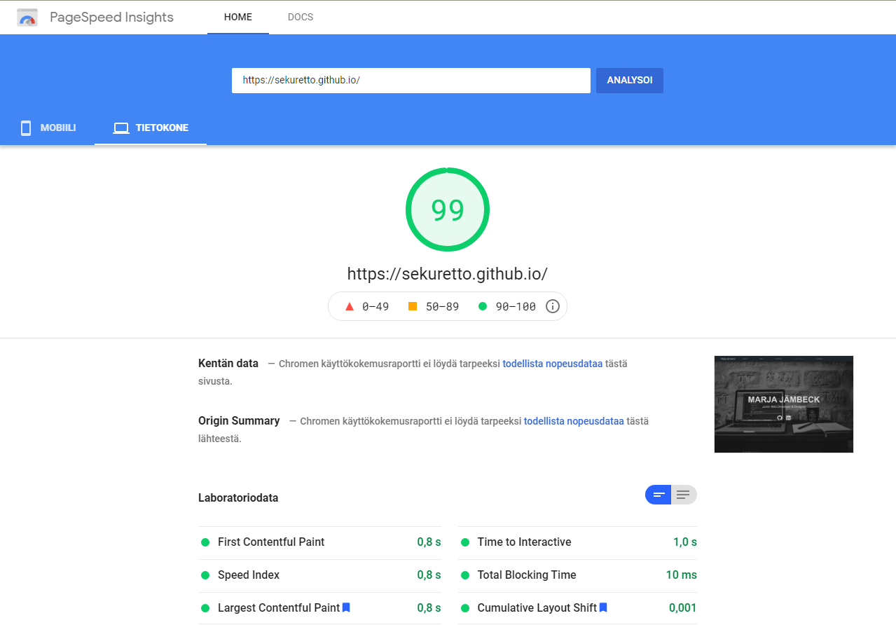
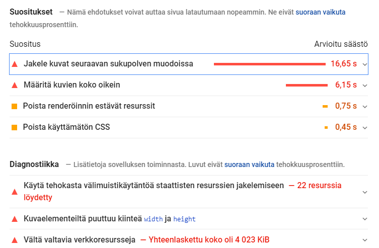

# Harjoitustyö

## Web-portfolion päivitys

Alkuperäinen portfolioni (https://sekuretto.github.io/) kaipasi päivitystä, joten otin sen harjoitustyöni aiheeksi. Olen toteuttanut aiemman portfolio-sivun myös Bootstrapilla, mutta käyttäen valmista, ilmaista Bootstrap portfolio teemaa [Stylish Portfolio](https://startbootstrap.com/theme/stylish-portfolio), jonka rakennetta olin vain muokannut ja lisännyt sivulle oman sisältöni. Halusin tässä harjoitustyössä korvata tämän vanhan portfolion, ja oman oppimisen sekä osaamisen näytön kannalta luoda sivupohjan Bootstrapilla ja muilla webtekniikoilla nyt alusta loppuun ihan itse. Sivun sisällön ja kokonaisrakenteen pidin kuitenkin pääosin samana kuin aiemmassa portfoliossa. Olen tähän asti pitänyt käyttämäni teeman sivurakenteesta, joten halusin mukailla ja matkia sitä myös nyt sivua uusiessani. Mutta nyt harjoitustyön yhteydessä aioin ja pystyin pohtimaan paremmin sivuston eri osien rakennetta, visuaalisuutta ja toimivuutta; erityisesti tiettyjen sivu-osioiden ulkonäköä ja toimivuutta siinä tarkoituksessa, että käytän sivua työnhaussa portfoliona ja mainontana omista taidoistani. Halusin työssä harjoitella myös erityisesti Sassin käyttöä, sekä mahdollisesti myös Google Material Designia. Lisäksi aikomuksenani oli parantaa uuden portfolio-sivuversion avulla jo aiemman sivun Pagespeed-tuloksia.

Screenshot alkuperäisestä portfoliosta (mobiili-versio):  

Screenshot uudesta portfoliosta (mobiili-versio):  

Alkuperäisen portfolioni lähdekoodi on nähtävissä [Githubin repositoriossani](https://github.com/sekuretto/sekuretto.github.io) kansiossa old_portfolio.

Koska saatan dokumentaatiossa viitata useaan otteeseen sivun eri osioihin ja kertoa niiden kehityksestä, lyhyenä selvennöksenä uuden portfolion sivurakenne on siis seuraavanlainen:

- navigaatio (navbar)
- header/showcase
- varsinainen sivun sisältö jaettuna section-elementteihin:
  - About (oma henkilökuvaukseni)
  - Skills (osaamani teknologiat kuvauksineen, Flexbox/Grid)
  - Portfolio/Projektit (varsinainen portfolio tekemistäni projekteista, Grid)
  - Image Gallery tai muut mahdolliset osiot sivujen laajentumista varten (navigaatioon ja sivurakenteeseen jätetty optio)
  - Contact (yhteystiedot)
- footer

Vanha portfolio tosiaan seurasi tätä samaa rakennetta.

## Resursointi (ajankäyttö)

Websivun koko rakenteen suunnitteluun ja sisältöön minun ei juuri tarvinnut käyttää aikaa, koska tosiaan hyödynsin pohjana jo aiempaa portfolio-sivuani. Käytin kuitenkin Figmaa, sekä Web-visualisointi -kurssin WV-H7 ja WV-H10-tehtäviä hyödykseni pohtiessani mitä muutoksia nyt tekisin sivun rakenteeseen tai ulkonäköön. Siksi minulla oli työtä aloittaessa jo aika selkeä kuva sivun rakenteesta sekä ulkonäöllisesti että HTML:n semanttisen rakenteen kannalta, joten aikaa ei kulunut työn aikana niin paljon erinnäiseen sivurakenteiden asettelujen testailuun tai ulkonäkövalintojen mietintään kuin olisi voinut kulua, jos olisin lähtenyt liikkeelle aivan tyhjästä ja ilman aiempaa sivuversiota. Lisäksi työtäni siivitti se, että halusin saada sivun julkaistavaan kuntoon mahdollisimman nopeasti, jotta voisin käyttää sitä työnhaun apuna ja taitojen näytteenä mahdollisimman nopeasti vanhan sivuversion tilalla.

Kokonaisuudessaan harjoitustyön tekoon kului noin pari kuukautta, kun tein sitä muun koulutyön ja töidenhaun ohessa. En kuitenkaan lähtenyt seuraamaan ajankäyttöäni työn aikana kovinkaan tarkasti tuntitasolla. Välillä omistin harjoitustyön teolle kokonaisen työpäivän kerrallaan ja vielä illallakin innostuttuani koodaamaan tai kirjoittamaan sisältöä. Välillä taas tein työtä muutaman tunnin kerrallaan eri päivinä. Ja varsinkin loppua kohti, kun harjoitustyön teossa oli jäljellä lähinnä dokumentointia ja websivu oli jo julkaistu, saatoin dokumentoinnin ohessa innostua käyttämään vielä jonkun satunnaisen tunnin jonkin pienen sivuelementin lisäviilaamiseen. Jos kuitenkin mittaan työskentelyäni karkeasti työpäivinä (n. 6h päivässä), niin näin mitattuna harjoitustyön valmistumiseen kului ehkä vajaa kolme viikkoa, eli n. 19 päivää.

Sivun perusrakenteen koodaamiseen kokonaisuudessaan Bootstrapin elementtien avulla ja vanhaa portfoliota mukaillen meni yhteensä noin neljä päivää. Pääosa tästä eli noin pari päivää meni pelkästään sivun sisällön tuotantoon (erityisesti parin sisällön laajennusta kaivanneen sivuosuuden kohdalla; Skills ja Projects/Portfolio) ja muokkaamiseen ja media queryjen viilaamiseen. Samalla kaiken koodailun rinnalla tein alusta asti myös työn dokumentointia kirjoitellen muistiinpanoja työn eri vaiheista ja etenemisestä.

Aloitin harjoitustyön ensin tekemällä sivun tyylimäärittelyt pelkästään Bootstrapin omilla tyyleillä, joita muokkailin tarpeellisissa kohdissa omalla CSS:llä. Kun sivun rakenne ja sisältö alkoi olla kasassa, otin tässä vaiheessa käyttöön myös Sassin npm:n avulla harjoitellakseni sen käyttöä. Yksi päivä kului kokonaisuudessaan siihen, kun muunsin kaiken siihenastisen sivulla käyttämäni oman CSS:ni Sassiksi, josta sitten käänsin sivulle uuden tyylitiedoston. Tässä vaiheessa työ alkoi olla pääpiirteissään ja sisällöltään jo valmis, ja julkaisin sivun Githubin pagesissa. Harjoitustyönä jatkoin silti sivun ja Sassin viilailua vielä suunnilleen kaksi päivää, joista ensimmäisenä päivänä pohdin ja testailin Sassilla vielä sivun asetteluja ja korjailin pikkuvirheitä. Toinen päivistä kului vielä pelkkään media queryjen lisäilyyn ja villaamiseen, jotta sain sisällön ja varsinkin kuvat asettumaan hyvin myös pienillä puhelimennäytöillä.

Kolme päivää kulutin tiedonhakuun ja tutkimustyöhön uppoutumalla Google Material UI:n dokumentaatioihin, kun pohdin millä tasolla ottaisin sen ohjenuoria mukaan työhöni ja viilaisin vielä sivujeni ulkonäköä. Kokeilin myös Material UI:n käyttöönottoa npm:llä ja testasin Material UI:n elementtityylien käyttöönottoa. Toisena päivänä uppouduin sitten enemmän Material UI:n design-dokumentaatioon, kun hain siitä ohjenuoria joita kannattaisi käyttää sivuillani elementtien korostukseen. Loppujen lopuksi päätin ottaa Material UI:n käyttöön vain CDN-linkin avulla, ja tutkiskelin päivän verran mitä tyyli-classeja sivuillani tarvitsisin tai olisiko jotain Bootstrap-elementtejä joita voisi korvata tai muokata Material UI:n vastaavilla.

Viimeisenä kulutin vielä useamman päivän (7-8 päivää) kirjoittaen kuntoon ja valmiiksi harjoitustyön dokumentaatiota. Samalla korjailin mm. vielä sivun ja kuvien responsiivisuutta ja grafiikan optimointia, lisäsin Material UI:n mukaisia tyylejä ja testailin sivun Pagespeed-tuloksia. Kun siis lasken yhteen nämä karkeat työpäivät, kului harjoitustyön tekoon suunnilleen 18 päivää.

Näiden 18 päivän lisäksi mukaan voi laskea ainakin yhden lisäpäivän, jonka käytin jo ns. sivun jatkokehitykseen. Mietin ja kokeilin koodata sivulle vielä kuvagalleriaa lisäsisältönä, vaikka päätin lopulta jättää tämän kehittämisen harjoitustyön ulkopuolelle. Jatkokehitysmielessä tein myös harjoitustyötä ja dokumentointia viimeistellessä hajanaisia lisätunteja tutkimustyötä erilaisista CSS animointi ja transition-efekteistä, joita sivuillani voisin soveltaa.

## Teknologiavalinnat perusteluineen

### Bootstrap

Käytin harjoitustyössä Bootstrapin sillä hetkellä uusinta versiota (v5.0.0-beta2). Uusimman version käyttäminen tarkoitti totta kai, että minulla oli käytettävissäni uusin Bootstrapin dokumentaatio sivujen rakentamisen apuna, ja sivut pysyvät myös pitempään yhteensopivina ja vakaina. Latasin Bootstrapin lähdetiedostot ja kopioin Bootstrapin päätiedoston bootstrap.min.css sivujen CSS-kansioon, josta Bootstrap-tyylit siis ladataan oman tyylitiedostoni kanssa. Luonnollisesti täytyi kopioida myös Bootstrapin käyttämä JavaScript-tiedosto lähdetiedostoista. Mutta käyttäen näitä kutistettuja lähdetiedostoja suoraan omasta sivustorakenteestani ja samalta palvelimelta, pyrin siihen ettei sivujen latautumiseen tulisi minkäänlaista viivettä tai kaatumisen riskiä kuin voisi olla jos käyttäisin Bootstrapia pelkän CDN-linkin kautta.

Otin siis Bootstrapin elementteineen työhöni mukaan jo alusta asti, ja rakensin sivujen perusrakenteen sillä ja sen elementeillä, sekä myös HTML:n semanttisella rakenteella. Omalla CSS:llä ja Sassilla lähdin sitten muokkaamaan käyttämiäni Bootstrapin elementtejä niiltä osin kuin tarvetta ilmeni, ja lisäsin myös omaa toiminnallisuutta elementteihin. Lisäksi hyödynsin Bootstrapin omia tyylejä ja classeja omien sivuelementtieni tyylien pohjana, millä tavoin sain vähennettyä kirjoitettavan CSS:n määrää. Mikä osaltaan taas vähensi päällekkäisten tyylimääritysten määrää ja selaimen turhaa tyylien ylikirjoittamista.

### Flexbox/Grid

Flexboxia on hyödynnetty sivun Skills-osion card-elementtien otsikoiden ja tähtien asettelussa, sekä social-link ikonien asettelussa header- ja Contact-osioissa, jotta ne on saatu aseteltua samalle riville siististi.

Gridiä hyödynsin sekä Skills- että Portfolio-osioiden korttien asettelussa, jotta niiden koko ja asemointi skaalautuu hyvin eri näyttökoossa media queryjen mukaan.

### Selaintuki & skaalautuvuus

[Bootstrap v5.0](https://getbootstrap.com/docs/5.0/getting-started/browsers-devices/) tukee mobiilissa Androidin osalta Chromea, Firefoxia ja Android-selainta/WebViewtä. Desktopissa tukee Windowsin osalta Chromea, Firefoxia, Microsoft Edgeä ja Operaa. Koin että jos huolehdin skaalautuvuudesta ja selaintuesta ainakin näille selaimille ja alustoille, erityisesti Chromelle, Firefoxille ja Edgelle sekä mobile-versiona Androidille, se olisi riittävä selaintuen laajuus. Sivujen kehitystyön tein Chromella, mutta testasin sivujen toiminnan ja skaalautuvuuden myös Microsoft Edgellä (versio 89.0), Mozilla Firefoxilla (versio 87.0) sekä puhelimellani (OnePlus8/Chrome).

Bootstrap v5.0 ei tue Internet Explorer-selainta, mutta tukee IE:n korvaavaa Edgeä. Koska IE on tosiaan vähitellen poistumassa historiaan, eikä sen käyttöä enää edes suositella, totesin tämän harjoitustyön kannaltakin että selaintuki IE:lle tuskin enää on tarpeellinen.

Tarkoitukseni oli alunperin lähteä tekemään sivuja mobile first-periaatteella siten, että sivut skaalautuvat ja CSS on suunniteltu ensisijaisesti mobiililaitteen ruuduille. Ja olisin käyttänyt media queryjä CSS:ssä skaalaamaan sivut sitten isommille näytöille. Käytännössä totesin kuitenkin, että oli järkevämpi tehdä skaalautuvuus toisinpäin, eli suunnittelin ja toteutin sivut ensin desktop-koossa, koska ajattelin että todennäköisempää ehkä kuitenkin on että portfolio-sivuja katsotaan työnantajien ja rekrytoijien toimesta ensisijaisesti kunnon tietokoneen näytöiltä. Ja koska sivuillani on yllättävänkin paljon tekstisisältöä, se myös asemoituu sisällön ympärille jäävän tilan kannalta siistimmin isolla näytöllä. Vasta desktop-tyylien oltua kunnossa lähdin skaalaamaan sivun sisältöä ja tyylejä pienemmille näytöille. Erityisesti otin skaalautuvuudessa huomioon gridit, ja sen että niiden sisältö ei alkanut näyttää pienellä ruudulla liian ahtaalta ja kapealta. Loin media breakpointteja myös reilusti enemmän kuin vain yleisimmät breakpointit, sillä halusin erityisesti sisällön leveyden ja yhden kuvista (About-osion omakuva) skaalautuvan ja asemoituvan nätisti minkäkokoisella näytöllä tahansa. Chromen Developer Tools oli siis skaalautumista säätäessä erityisen kovassa käytössä.

### Git (pages) / Github

Sivut on harjoitustyönä julkaistu JAMK Gitlabiin, josta niitä voi Pagesin avulla käyttää suoraan verkkosivuna. Sivujen toteutukseen käytin Git-versionhallintaa suoraan konsolista ja koodin sekä dokumentaation kirjoittamiseen käytin Visual Studio Codea.

Sivut on julkaistu myös [Githubiin](https://github.com/sekuretto/sekuretto.github.io) github-pagesin päälle entisen version tilalle. Tein itse asiassa pääasiallisen kehitys- sekä julkaisutyön sivuille Githubissa, joten Gitlabiin julkaistu sivu on sama versio tästä.

### SASS

Päätin pyrkiä käyttämään Sassia harjoitustyössä harjoitellakseni lisää sen käyttöä, ja koska jo Sassia harjoitellessa pidin sen visuaalisesta hierarkisesta rakenteesta. Mielestäni mahdollisuus kirjoittaa Sassissa CSS:ää sisentämällä (nesting) auttaa paljon CSS:n ja tyylimääritysten periytymisen ymmärtämisessä.

Käytin Sassia asentamalla koneelle Node.js:n, ja Visual Studio Codella npm:n, jolloin saatoin asentaa ja käyttää Sassia suoraan Visual Studio Coden omasta konsolista. Tämä oli käytettävyydeltäänkin ehdottomasti paras ja vakain tapa käyttää Sassia, koska olin Web-visualisoinnin H8-tehtävässä kokeillut myös Visual Studio Coden -lisäosaa Live Sass Compiler, joka ajoi sekin kyllä asiansa mutta oli silti epävakaampi ja altis kaatumaan koska ilman terminaali-ikkunaa sen koodinseurantaa ei meinannut muistaa pysäyttää jos vaikka poisti Sass-tiedostoja, joka sitten aiheutti lisäosan kaatumisen.

Kuva Sass-kehityksestä npm:n avulla Visual Studio Codesta:
  
Kuvasta näkyy myös, että kehitin sivua ja harjoitustyötä tosiaan Githubin repositorioon alikansiossa [dev_portfolio](https://github.com/sekuretto/sekuretto.github.io/tree/master/dev_portfolio). Tämän kansion kopioin Gitlabiin harjoitustyöksi.

Jaoin Sass-tiedostoni seuraavalla tavalla:

- style.scss: päätiedosto josta CSS käännetään, sisältää perus tyylit nav ja header(showcase) -osioiden tyyleille, sekä eri section -osioiden tyyleille
- \_config.scss: konfiguraatio-tyylit eli fontit ja muuttujat väreille
- \_gridcard.scss: sisältää tyylit grid-muotoiluille korttialueille (Skills & Projects) sekä itse korteille
- \_media.scss: kaikki media queryt

Koin Sassin hyödyllisyyden tämän laajuisen websivun rakentamisessa ehkä vielä vähän kevyeksi. Tämän laajuisessa työssä ei ehkä ole ihan niin merkittävästi CSS:ää, että sinällään olisi merkittävää käyttöhyötyä siitä että käyttää Sassia ja pilkkoo CSS:ää sen sijaan että olisi vain käyttänyt tavallista CSS:ää. Sassin harjoittelun ja ymmärtämisen kannalta Sassin käyttö kuitenki ehdottomasti oli hyödyksi, ja sain kuitenkin harjoiteltua muuttujien ja importtien, vähän jopa extendien käyttöä sekä tietenkin Sassin hallintaa yleisesti. Sain mielestäni hyvää harjoitusta ja varmuutta Sassin käyttöön, ja tämän jälkeen käytän sitä mielelläni jopa ensisijaisesti tavallisen CSS:n kirjoittamisen sijaan missä tahansa muussakin webprojektissa jos vain mahdollista.

Pohdin Sassin muokkaamisen yhteydessä myös sitä, että Bootstrapin lähdekoodinkin olisi voinut asentaa npm:n kautta ja päästä sitä kautta käsiksi ja muokkaamaan Sassilla suoraan myös vaikka Bootstrapin värejä ja muuttujia, kuten [Bootstrapin omasta dokumentaatiosta](https://getbootstrap.com/docs/5.0/customize/sass/) näkyy. Näin olisin ehkä voinut rakentaa suoraan Bootstrapin pohjalta sivuilleni oman custom Sassin, sen sijaan että Bootstrap ja oma CSS/Sassini ovat nyt erillään. Pohdin kuitenkin että koska sivuni on vain portfolio-sivu eikä siksi laajuudeltaan mitenkään iso, olisi tälläinen Bootstrapin suora kustomointi ehkä turhan työläs kokeilu sivujeni kokoon nähden. Ei toki ole poissuljettua, että jos vielä kehitän sivujani, että myöhemmin kokeilisin Bootstrapin kustomointia vielä.

Koska sekä Bootstrapin että Material UI:n muokkaamisessa on mahdollista käyttää Sassia, auttoi kunnollinen Sassin opettelu joka tapauksessa ymmärtämään lisää CSS-kirjastojen dokumentaatiota, ja sitä kuinka niitä on mahdollista muokata vielä paremmin omaan käyttöön.

### Visuaalisuus ja siihen liittyvät valinnat perusteluineen

Sivun navbar ja header/showcase osiot, sekä päävärit:  

Sivun visuaalisuus ja värimaailma määräytyi pitkälti otsikkokuvan (pexels-negative-space-169573.jpg) pohjalta, joka on Pexels -kuvapankkipalvelusta jo aiempaan portfolioversioon etsimäni ja siellä käyttämäni kuva. (Kuvan alkuperäinen sijainti: https://www.pexels.com/fi-fi/kuva/apple-etatyo-kannettava-tietokone-koodaus-169573/) Valitsin kuvan aikanaan, koska pidin sen neutraalista harmaasta/tummasta värimaailmasta ja kuvan aihe läppäreineen, muistikirjoineen ja kahvikuppeineen oli ammattimaisen oloinen ja kuvasi mielestäni hyvin IT-alan opiskelijan elämää portfoliokuvana. Käytän kuvaa sivuillani siis ns. hero imagena sivun pääotsikon eli nimeni taustana. Käytin apuna myös W3Schoolsin How To -opasta [Hero Imagen](https://www.w3schools.com/howto/howto_css_hero_image.asp) teosta, ja tummensin kuvaa hieman lisää jotta sen päällä oleva teksti erottuu selvemmin. Käytin kuvan päällä olevassa pääotsikko-tekstissä myös hieman pehmeämpää valkoista väriä (#dadada) kuin puhdasta valkoista, joka erottuu kuvasta hyvin mutta ei kuitenkaan "loista" silmiä rasittavasti tumman kuvan päällä. Kuvaa mukaillen halusin käyttää sivulla myös pääasiallisesti Bootstrapin tummaa teemaa, josta tuli navigaatiopalkin väri.  
Sivujeni pääväreiksi muodostui siis lopulta Bootstrapin oma Dark-teemaväri (#212529, navbar ja tummien sivuosioiden taustaväri) sekä pehmeä valkoinen (#dadada, vaaleiden sivuosioiden taustaväri). Koska nämä värit toistuvat kauttaaltaan koko sivulla, se tuo mielestäni sivuun myös yhtenäisyyden tuntua. Näiden lisäksi käytin muutamia sekundaarisia värejä. Linkkien värinä on tavallinen musta (#000000), ja mahdollisiin elementtien varjostuksiin käytän harmaan sävyä (#555555). Erityisesti navigaatiossa käytin vielä hover-efektin värinä tummaa harmaata (#313131). Skills-osion tähtien värinä taas toimii kultaan vivahtava keltaisen sävy (#d6b600). Lisäksi korttielementtien taustavärinä on tavallinen valkoinen (#ffffff).

Hain kaikessa sivuni suunnittelussa sitä, että sivuni näyttäisi ammattimaiselta ja siistiltä, koska kyseessä on kuitenkin työnantajille esiteltävä portfoliosivu. Koska sivulla on kokonaisuudessaan paljon kirjoitettua sisältöä, halusin visuaalisessa mielessä pitää huolen siitä että tekstillä ja elementeillä sekä sivun eri osioilla on ns. "tilaa hengittää" ja sivu sisältöineen ei näyttäisi ahtaalta ja täyteen pakatulta. Halusin myös että eri sivun osiot näkyvät eroteltuna selkeästi toisistaan, joten käytin tummaa Dark-väriä ja valkoista tässäkin siten että eri osioiden taustaväri vaihtuu osioittain. (Header ja navigaatio tumma, About vaalea, Skills tumma jne...). Kaikissa tummissa osioissa käytin otsikkovärinä pehmää valkoista (#dadada).

Sivuille sijoitetuissa ikoneissa (Github/LinkedIn) käytin Font Awesome -ikonikirjastoa (https://fontawesome.com/). Tämä oli pääasiassa tottumuskysymys, sillä Bootstrapissa on toki olemassa omakin ikonikirjasto ja kokeilin harjoitustyön aikana lyhyesti myös Material UI:n ikonikirjastoa (https://fonts.google.com/icons). Olen kuitenkin käyttänyt Font Awesomea usein jo aikaisemminkin, ja se on mielestäni ilmaisversionakin vielä laajempi ja huomattavasti monipuolisempi kuin muut olemassaolevat ikonikirjastot.

Sivun About-osio ja rullatessa näkyviin tuleva Takaisin alkuun-painike:  

Typografiaa olen pohtinut erityisesti navigaatiossa ja About-osiossa. Navigaatiossa käytän fonttina Googlen fonttia [Raleway](https://fonts.google.com/specimen/Raleway), muutoin sivulla on käytetty Bootstrapin [natiivia fontstackia](https://getbootstrap.com/docs/5.0/content/reboot/#native-font-stack). Koska navigaatio pysyy näkyvissä koko ajan sivua rullatessa, ajattelin että erilainen fontti saa navigaation linkkitekstit ja siten koko navigaatio-elementin erottumaan sivun muusta tekstistä ja elementeistä, ja korostaisi siten sivun käytettävyyttä ja navigaation sijaintia. Ralewayn valitsin navigaation fontiksi oikeastaan ihan kokeilemalla, ja totesin sen sitten olevan hyvä vaihtoehto, joka myös jäi. Ralewayn hieman korkeampi rivikorkeus tekee siitä erottuvamman ja selkeämmän näköisen.  
About-osion tekstissä on käytetty Bootstrapin .lead-luokkaa, joka tekee siitä normaalia tekstiä erottuvamman lisäämällä fonttikokoa ja vähentämällä fontin paksuutta (font-weight). Tekstissä pohdin myös rivien pituutta, ja erityisesti isommilla näytöillä oman kuvani tarkoituksena (sijoittelulla (float)tekstin oikealle puolelle) on katkaista rivipituus tekstikappaleissa siten, että se pysyy helppolukuisena. Pienemmillä näytöillä rivipituus lyhenee ja katkeaa luontaisesti sivun kokonaisleveyteen, jota olen säätänyt myös elementti-luokalla .content, joka kaventaa kaiken sivusisällön leveyden 75% kokonaissivuleveydestä (pienemmillä näytöillä media queryjen avulla vähän leveämpi). Pienemmissä näyttöko'oissa (alle 700px) About-osion kuva asemoituu kaiken tekstin yläpuolelle, jotta se ei "litistä" tekstiä vasemmalla puolellaan liikaa ja siirtyy visuaalisesti miellyttävällä tavalla keskelle. Tähän kuvan asetteluun tuli myös käytettyä paljon media queryjä, jotta kuvan asemointi ja koko muuttui mielestäni sulavasti.

Navigaatio on tosiaan suunniteltu siten, että se näkyy jatkuvasti ja sen linkkejä klikkaamalla pääsee sivulla siirtymään linkin nimen mukaiseen sivuosioon. Käytettävyyden kannalta ja sivun kaiken sisällön kokonaispituuden vuoksi päätin kuitenkin lisätä sivun alareunaan myös oman painikkeen sivun alkuun palaamiseksi. Painike tulee siis näkyviin heti, kun sivua on rullattu alaspäin header-kuvan ohi, ja sitä painamalla sivu rullaa takaisin alkuun. Tällainen painike minulla oli vanhassakin portfoliossa, joten idea siitä tuli osaltaan myös sieltä. Sivua koodaillessa sain sen verran tiheään tahtiin itsekin rullailla ja selailla sivua edestakaisin, että painiketta tuli aika äkkiä jopa ikävä. Ja kun löysin W3Schoolsista simppelin tutoriaalin [How TO - Scroll Back To Top Button](https://www.w3schools.com/howto/howto_js_scroll_to_top.asp) painikkeen tekemiseksi JavaScriptillä, niin päätin hyödyntää sitä.

Sivun Skills-osio kortteineen:  

Merkittävin vanhasta portfoliostani uudistunut osio ja siten kehitystyön vaihe oli sivujeni Skills-osio, jonka suunnitteluun ja Grid-rakenteen rakenteluun ja säätelyyn kului kaksi päivää, mukaanluettuna sisällöntuotanto. Vanhassa portfoliossa olin Skills-osioon kirjaimellisesti vain listannut nimeltä merkittävämpiä IT-alan taitojani ja työkaluja, joita osaan käyttää. Nyt halusin kuitenkin tehdä osiosta huomattavasti visuaalisemman. Koska käytän sivua työnhaussa, halusin saada myös arvion osaamistasostani näkyväksi, jotta mahdollinen sivuillani käyvä työnantaja näkisi jo jollain tapaa nopeasti ei vain sen mitä osaan vaan myös kuinka hyvin mahdollisesti jotain osaan. Eli pohdin suunnitellessa, että lisään Skills-osioon kunkin taidon kohdalle jonkinlaisen 1-5 pisteen skaalan tai progress-mittarin tapaisen näyttämään taitotasoa.  
Päädyin lopulta käyttämään tässä Bootstrapin card-elementtejä. Kukin kortti on siis nimetty tietyn taidon/ohjelmointikielen/työkalun mukaan, ja kyseisessä kortissa kerron lyhyesti osaamisestani ja mitä mahdollisesti olen tehnyt tällä taidolla. Visuaalisemman sain korteista kun lisäsin niiden otsikoihin myös taitotason mittariksi tähdet, jotka siis osoittavat asteikolla 1-5 arvioimani oman taitotasoni kunkin kortin taitolle. Lisävisuaalisuutta sain kortteihin lisäämällä niihin pienet, kunkin ohjelmointikielen/työkalun kuvakkeet. Mielestäni nämä pienet kuvakkeet rikkovat myös sopivalla tavalla muuten ulkonäöltään samanlaisten, toistuvien korttien rykelmän, jossa kortit muuten näyttäisivät samanlaisilta ja tylsiltä lukea. Näissä korteissa perehdyin tosiaan erityisesti Gridin käyttöön, ja suunnittelin millaisiin riveihin ja palstoihin kortteja asettelisin missäkin näyttökoossa. Näytön koosta riippuen nämä kortit skaalautuvat joko kolmen, kahden tai yhden kortin riveihin.

Sivun Portfolio-osio kortteineen:  

Portfolio-osion toteutin myös Bootstrapin korteilla. Näihin visuaalisuutta tuo erityisesti kortteihin lisätyt kuvat.

Kaikkien käyttämieni korttielementtien ja Gridien kohdalla, eli sekä Skills- ja Portfolio-osioissa keskityin typografisesti erityisesti siihen että korttien välille ja ympärille jää tilaa eivätkä ne asettuisi liian ahtaasti. Samalla Grid-palstoja suunnitellessa ajatukseni oli se että kuten About-osiossa tekstirivin pituus ei korteissakaan kasvaisi näyttökoon kasvaessa liian pitkäksi. Ja kuitenkin isommalla näyttökoolla myös niinpäin, että kortteja ei tule liikaa samalle riville jolloin korttien sisältö ja teksti skaalautuisi esteettisesti liian kapeaksi. Siksi päädyin lopputulokseen että suurimmilla näytöillä Grid-rivillä on enintään kolme korttia, ja näytön kutistuessa Grid skaalautuu kahden kortin riveiksi. Pienimmillä (alle 1000px) näytöillä Grid on enää vain yhden kortin levyinen.

Portfolio-osion kortit skaalautuvat hieman eri tavalla. Koska korteissa on projektikuvan ja kuvaustekstien muodossa enemmän tekstiä kuin Skills-korteissa, kolmen kortin rivi olisi isollakin näytöllä tehnyt korteista liian pitkiä ja kapeita, ja niiden sisältö olisi näyttänyt ahtaalta. Siksi määrittelin Portfolio-osion Gridin kahden kortin riveiksi. Ja jo 1250px:iä pienemmillä näytöillä Grid vaihtuu tässä yhden kortin levyiseksi.

Sivun Contact Info-osio & footer:  

Viimeisenä sivulla on yhteystietojen osio sekä footer, joista ei ole paljonkaan sanottavaa. Sivun kaiken muun sisällön jälkeen keskitetty pieni tekstialue, jossa lukee vain yhteystietoni korostuu ja nousee näkyville.

Otin harjoitustyöni loppuvaiheessa myös käyttöön [Googlen Material Design](https://material.io/)in, ja kulutin pari päivää sen testailuun ja dokumentaatioihin uppoutumiseen. En kuitenkaan asentanut Material UI:tä vaan käytän sitä CDN-linkin kautta. Vaikka kokeilin kyllä [Material UI](https://github.com/material-components/material-components-web):n asentamista ja käyttöönottoa npm:n kautta, ja Material Design-tyylien käyttöönottoa siten, oli loppujen lopuksi sujuvampaa käyttää vain CDN:ää. Jos olisin ottanut käyttöön Material UI:n jo heti työn alkuvaiheessa Bootstrapin ja Sassin rinnalla, olisi ollut ehkä helpompi ottaa käyttöön Material UI:n elementtejä. Nyt Material UI on siis lähinnä lyöty valmiin sivuston päälle, ja sen elementteihin perehtyminen ja käyttö jäi kevyeksi. Mutta koska ehdin rakentaa koko sivun jo Bootstrapin elementtien varaan, olin ehkä rehellisesti työn loppuvaiheessa jo liian laiska lähteäkseni enää vaihtamaan elementtejä Material UI:n vastaaviin.

Yritin silti uppoutua erityisesti Material Designin dokumentaatioon ja tutkin mitä sen visuaalisia sääntöjä voisin vielä ottaa mukaan työhöni.
Ja löysin siltä kyllä huomion arvoisia seikkoja. Erityisesti Material Design sai minut ottamaan huomioon sen että lisäsin navigaatioon paremman ja erottuvamman hover-efektin, joka korostaa paremmin navigation toimintaa. Lisäksi opin ottamaan huomioon eri sivuelementtien [elevation-tason](https://material.io/design/environment/elevation.html) ja kuinka niitä voidaan korostaa eri-syvyyksisillä varjoilla.

Navigaation hover-efekti:  

Otin siis Material UI:stä käyttöön sen [Elevation-classit](https://github.com/material-components/material-components-web/tree/master/packages/mdc-elevation), ja lisäsin niitä useimpiin sivuelementteihin. Elevation määritellään Material UI:ssa siis elementtiin lisättävällä classilla: mdc-elevation--z1, jonka lopussa, z-kirjaimen perässä oleva numero-arvo voi vaihdella arvojen 1 ja 24 välillä. Numero 1 aikaansaa siis kevyimmän varjon/elementin kohotusefektin ja 24 suurimman. Yritin nappuloissa seurata Material Design-ohjeistusta eri sivukomponenttien elevation arvoista, eli navigaatiossa käytin arvoa 16, korttielementeissä ja About-osion kuvassa arvoa 5, korttien nappuloissa arvoa 2 ja Takaisin alkuun -nappulassa arvoa 6. Vaikka näin aikaansaadut elementtien varjostukset ovat suurimmalta osin melko keveitä, ja niitä jopa nopealla silmäyksellä hädintuskin huomaa, tuntuu että ne silti antoivat mukavaa syvyyttä ja eloisuutta sivulle.

Eri sivuelementtien varjot (nav, kortit, nappula):  

Koska tosiaan loppujen lopuksi käytin Material UI:stä nyt vain sen elevation classeja enkä kokonaisia elementtejä, oli sivun vakauden kannalta mielestäni ihan ok että käytin tässä vaiheessa vain Material UI:n CDN:ää. Jos CDN-linkki sattuisi olemaan alhaalla, ei sivuiltani lakkaa toimimasta mikään muu kuin elementtien varjostukset. Jos myöhemmin otan käyttöön myös Material-elementtejä, sitten on turvallisempi vaihtoehto asentaa Material UI kunnolla.

Viimeinen huomionarvoinen seikka sivujeni visuaalisuudessa on CSS-animointi, tai tässä tapauksessa sen puute. Pohdin kyllä pitkään työssäni olisiko ollut jotain hyviä ja elegantin näköisiä animointi-efektejä, joita sivuillani voisin käyttää, mutta loppujen lopuksi päädyin siihen tietoiseen päätökseen että en tässä vaiheessa tehnyt sivuille mitään animointi-efektejä. Tähän päätökseen johti edelleen se ajatus, että sivu on työnhaussakin käytettävä portfolio-sivu ja halusin sen näyttävän ammattimaiselta ja edustavalta. Olin siksi hyvin varovainen valitsemaan mitään animointia sivun julkaistulle versiolle edes harjoitustyön tai kokeilun takia, jotta sivu ei alkaisi sen vuoksi vaikuttaa sisällöllisesti "levottomalta".

Tällä hetkellä ainoa transitio-efekti sivuilla on Takaisin alkuun paluu -nappulan sekä About-osiossa olevan nappulan skaalaus-efekti (transform: scale()) nappeja painettaessa, mikä korostaa nappien toimintaa ja tärkeyttä.

### Pagespeed

Testasin portfoliosivuni latausnopeuden [Pagespeed Insightilla](https://developers.google.com/speed/pagespeed/) sekä alkuperäisen Github-portfolion kanssa ennen harjoitustyön aloittamista, että työn päätteeksi uudella portfolioversiolla, kun olin päivittänyt sen vanhan portfolion tilalle Github-pagesin päälle.

Alkuperäisen portfolion Pagespeed-tulokset Githubissa:  
  

Tuloksissa oli siis jonkin verran parannettavaa varsinkin mobiiliversion osalta, ja tavoitteeni oli harjoitustyössäni korjata tilannetta. Rehellisesti en alkuperäisen websivun luomisen yhteydessä ollut lainkaan tullut pohtineeksi sivujen toimivuutta tai kuvatiedostojen kokoa nopeuden kannalta, joten nyt oli harjoitustyössä hyvä tilaisuus siihenkin. Mobiiliversio kaipasi tuloksen perusteella erityisesti juuri grafiikan optimointia sekä ylimääräisen koodin siivousta.

Pagespeed-tulos parani huomattavasti jo puhtaasti sivun uudelleenrakennuksella kokonaisuudessaan, sillä sivuilta poistui näin heti kaikki aiemman portfolio-version ja siinä käytetyn Stylish Portfolio-teeman sisältämä ns. "turha" koodi. Lisäksi kutistin joidenkin sivulta löytyvien valokuva-tiedostojen kokoa jopa reilusti, mikä nopeutti niiden latausaikaa vaikuttamatta kuitenkaan mitenkään huomattavasti kuvanlaatuun.

Header/showcase -kuvassa otin huomioon myös grafiikan optimointia ja kuvan responsiivisuutta. Eli header-kuvasta on kolme eri resoluutioversiota ja media queryillä määrittelin että riippuen näytön koosta selain lataa käyttöön pienemmän tai isomman kuvaversion.

Parannukset Pagespeed-tuloksiin uudella portfoliolla:  
  

Varsinkin mobiiliversion pagespeed parani siis huomattavasti, joten vaikka tulos näyttää vielä että jotain pientä viilattavaa voisi ollakin vielä, olen oikein tyytyväinen lopputulokseen.
PageSpeed ehdotti erityisesti yhä sivun kuvien muuttamista seuraavan sukupolven muotoihin (JPEG 2000, JPEG XR ja WebP) ja joidenkin kuvien kokojen kutistamista entisestään. Varsinkin sivun mobiiliversiota varten voisin kyllä kokeilla vielä myöhemmin muuntaa ainakin osan sivun kuvista esim. Googlen WebP-formaattiin, joka alkaa tällä hetkellä olla jo selaimissa laajasti tuettu.

Pagespeedin suositukset ja diagnostiikka:  

Lisäksi korostan huomiota että koska tein harjoitustyöhön liittyvän kaiken kehitystyön Githubissa ja ensin Githubiin julkaistavan sivun parissa (josta Gitlabiin julkaisemani versio on vain kopio), kaikki PageSpeed-tulokset koskevat siis Githubin sivuversiota. En testannut PageSpeediä Gitlab-sivuun sivun sinne kopioinnin jälkeen, koska se sivu ei tule olemaan julkisesti saatavilla muuten kuin tämän harjoitustyön muodossa.

## Yleisiä mietteitä työn kulusta ja mitä tuli opittua

Opin ehdottomasti parempaa ymmärrystä Bootstrapin käytöstä ja sen eri elementeistä. Tutustuin paremmin Bootstrapin eri tyyppisiin elementteihin ja niiden muokkaamiseen.

Kaikkein eniten koin että sain oppia ja varmuutta Sassin käyttöön. Tuntui, että taidot sen kanssa kasvoivat kohisten ja käytän Sassia jo aika luontevasti. Tulen varmasti käyttämään sitä mielelläni myös jatkossa. Pidän Sassista erityisesti, koska se tekee CSS:n kirjoittamisesta paljon loogisempaa ja erilaisten tyylien periytymisestä ymmärrettävämpää, kun tyylejä voi kirjottaa siinä sisäkkäin sisennysten avulla.

Myös Gridin käyttöön tuli työn aikana harjoitusta. Grid-rakenteen muotoutumisen looginen ymmärtäminen sitä CSS:llä koodatessa on vielä ollut pieni kompastuskivi itselle, joten kaikki sen harjoittelua tukeva haaste on vielä hyväksi.

Aikataulutustani olisin sikäli voinut parantaa, että harjoitustyöni teko ja sen myötä kurssisuoritukseni myöhästyi aika roimasti suunnitellusta, koska harjoitustyö (ja sitä myöten kurssisuoritus) jäi roikkumaan rästityönä pitkään. Vaikka loppujen lopuksi varsinaisesti harjoitustyön tekemiseen alusta loppuun ei kuitenkaan kulunut ajallisesti kuin muutama viikko. Kuitenkin sekä kurssisuorituksen kiirehtimiseksi, että siksi, että halusin saada sivut melko nopeasti esiteltävään kuntoon työnhakua varten pakotti minua vähän kiirehtimään sivujen valmistumista. Sen vuoksi tosiaan päädyin jättämään animointien ja Material UI:hin perehtymisen ja käyttöönoton työssä vähemmälle huomiolle ja odottamaan sivun myöhempää jatkokehitystä. Tottakai sivusta olisi näiden kokeilulla ja lisäpanostuksella saanut varmasti vieläkin vaikuttavamman ja visuaalisemman, mutta tasapainoilu ajankäytön (työn valmistumisen) ja "riittävän hyvän" kanssa vei tässä suhteessa voiton.

Googlen Material Designin ja UI:n ymmärrystä tuli kuitenkin jonkin verran myös, kun harjoitustyön aikana tuli nyt ajan kanssa uppouduttua senkin dokumentointiin. Ainakin sen verran, että uskon jatkossa helpommin tunnistavani käyttöliittymiä katsoessani missä on mahdollisesti käytetty tai ainakin otettu inspiraatiota Material UI:stä. Ja missä Material-tyylejä olisi itsenikin hyvä käyttää. Aion ehdottomasti myös jatkaa sivujeni kehittämistä ja päivittämistä vielä jälkeenpäin, ja kokeilla vielä myöhemmin uudestaan Material UI:n asentamista ja mitä sen tyyleillä ja elementeillä voisi saada aikaan.

Myös sivuston latausnopeuteen ja erityisesti grafiikan optimointiin tuli perehdyttyä aika syvällisesti. Tässä oli aika hyvänä pohjana se, että minulla tosiaan oli jo aiempi sivuversio ja käytin sivuilla samaa grafiikkaa kuin tässä aiemmassa versiossa. Se antoi valmista osviittaa, mistä lähteä petraamaan pagespeed-tulosta, mikä oli nimenomaan grafiikan optimointi.

Kaikin puolin harjoitustyö opetti ja harjoitti eteenpäin kurssin harjoituksissa jo kokeiltuja web-visuaalisuuden osa-alueita. Mockupista varsinaiseksi sivuksi ja sivurakenteiksi sekä semanttiseksi HTML:ksi etenemisen ajattelu ja vaiheet, typografian ja asettelun huomiointia, responsiivista designia ja mobile first -suunnittelua sekä grafiikan optimointia suorituskykyä varten, Flexbox/Grid, CSS-kirjastojen käyttöönotto ja niihin syvempi tutustuminen ja muokkaus sekä Sass. Kurssiharjoitusten aiheista vain web-lomakkeet ja CSS-animointi jäivät itseltäni tässä vaiheessa vähemmälle huomiolle. Myöskään omaa SVG-grafiikkaa en tällä kertaa lähtenyt tekemään.
Omaa työtä tekemällä oppi myös hyvin huomaamaan millaista tasapainoilua visuaalisesti hyvännäköisen käyttöliittymän tuottaminen voi olla. Suunnittelun pohjalla on tietenkin kaikki yleisesti hyväksihavaitut seikat visuaalisessa suunnittelussa, kuten typografia, värit, elementtien tilankäyttö ja asemointi. Mutta osin visuaalisessa suunnittelussa voi olla mukana myös koodarin omaa visuaalista silmää ja tuntumaa siitä mikä näyttää hyvältä. Ja tietenkin mukana on myös käytettävyys-seikat eli kaiken täytyy myös toimia käyttöliiittymässä käyttäjän kannalta loogisella tavalla jota esim. Material Designissa on otettu paljon huomioon. Ja tietenkin on otettava huomioon myös skaalautuvuus eri laitteille, sivun performance ja saavutettavuus...puhumattakaan projektin ajanhallinnallisista seikoista. Pelkän websivun lopullinen visuaalisuus ja käyttöliittymäsuunnittelu on siis monen huomioitavan seikan summa.

### Sivun mahdollinen jatkokehitys

Sivu on rakenteeltaan ja sisällöltään HTML:nä aika pitkä, joten aloin kyllä pohtia jo sekä jatkokehityksen että käytettävyyden ja visuaalisuuden kannalta, että ainakin jos sisältöä tulee sivulle yhtään lisää, niin voisi olla viisaampi jakaa sisältö alisivuiksi yhden pitkän sivun sijaan. Varsinkin Portfolio-osion kortit muuttuvat pienemmillä (n. 600px tai vähemmän) näytöillä sekä sisällön ja skaalautumisen takia jo melkein liian pitkiksi. Täytyisi siis pohtia vähentäisinkö korttien tämänhetkistä sisältöä, vai muuntaisinko ne pienemmiksi korteiksi jotka avaamalla lisätieto aukeaisi näkyviin vaikkapa modaleiksi, mikä osaltaan lyhentäisi sivun sisältöä. Material UI:ssa oli erityisen hyvännäköisiä korttien [designpohjia](https://material-components.github.io/material-components-web-catalog/#/component/card) tähän, joita voisi hyödyntää.

Vähän ylimääräisenä työnä kulutin tosiaan jo päivän verran eräänlaiseen jatkokehittelyn suunnitteluun, koska pohdin myös kuvagalleria-osion lisäämistä sivuille ja testailin jo senkin koodausta ja asettelua yhdeksi osioksi sivulle. Ajatuksenani oli rakentaa sivulle vielä grid-muotoinen image gallery-osio, josta kunkin kuvan voisi avata omaan modal-ikkunaan. Päätin kuitenkin jättää sen kehittelyn vielä tämän harjoitustyön ulkopuolelle. Pääasiassa siksi, että halusin kiirehtiä harjoitustyön valmistumista, ja vaikka kuvagalleria lisäisikin sivun visuaalisuutta ja voin harjoitella siinä vielä esim. animaatiota tai muita visuaalisia kikkoja, ajattelin että sivu sisältää jo portfolio-sivun tärkeimmän ja oleellisimman sisällön, joten siinä mielessä sivu täyttää jo tehtävänsä. Pohdin tässäkin silti joko mahdollista Material UI:n käyttöä tai Bootstrapin/Materialin modaleja.

Vaikka tässä vaiheessa tosiaan jätin sivuilta pois kaikenlaisen animoinnin, jotain vaikka tietyn elementin animointia saatan silti lisätä myöhemmin sivulle kunhan keksin jotain sopivaa. Esimerkiksi jos lisään sivuille vielä kuvagallerian, niin siihen ainakin voisi keksiä jotain sopivaa animointia.

Yksi efekti jonka olisin halunnut saada toimimaan on, että pienemmillä näytöillä avautuva Bootstrapin toggle-navigaatio sulkeutuisi automaattisesti linkkiä painettaessa. Nyt navigaatio jää linkin klikkauksen jälkeen auki. En kuitenkaan löytänyt tähän ihan helppoa ratkaisua.

## Arvosanaehdotus itselle perusteluineen

Arvelisin että harjoitustyöni on tällä hetkellä ainakin arvosanan 3 arvoinen, eli ihan keskiverto. Kyseessä on tosiaan pelkkä portfoliosivu, joten rakenteeltaan se ei siinä mielessä ole kovinkaan haastava. Haastetta oli tosiaan enemmänkin siinä tasapainottelussa kuinka pitkälle visuaalisilla lisäkikoilla ja aikataulun venyttämisen sekä sivun ammattimaisen ulkonäön puitteissa sivun näyttävyyttä viitsi lähteä venyttämään.

Uskoisin että vähintään arvosanan 3 edellyttämät tekniikat ja niiden harjoittelu kuitenkin täyttyvät työssäni. Eli käytössä Bootstrap ja Sass (npm:n avulla) sekä Flexbox/Grid. Lisäksi visuaalisuutta, käyttöliittymäsuunnittelua sekä skaalautuvuutta ja selaintukea on mietitty. Puhumattakaan sivun suorituskyvystä, eli Pagespeed mittauksia ja grafiikan optimointia on tehty. Ja tietenkin Git on ollut käytössä koko harjoitustyön teon ajan, sekä JAMKin Gitlabin että Githubin suuntaan.

Uskoisin, että työstäni jäi vielä vähän uupumaan panostusta jotta tälle voisi antaa arvosanaa 4, vaikka ehkä osin onnistuinkin täyttämään arvosanan 4 tavoitteita hyvällä selaintuella ja skaalautuvuudella. Uskoisin että työni dokumentointi ja valintojeni vertailua ja perustelu on sekin ihan pätevää. Mutta ainakin CSS-animointia tai SVG-grafiikan hyödyntämistä puuttuu sivujeni visuaalisesta toteutuksesta, ja Material Designin/Material UI:n parempi ja laajempi käyttöönotto olisi sekin korottanut työn laatua.
