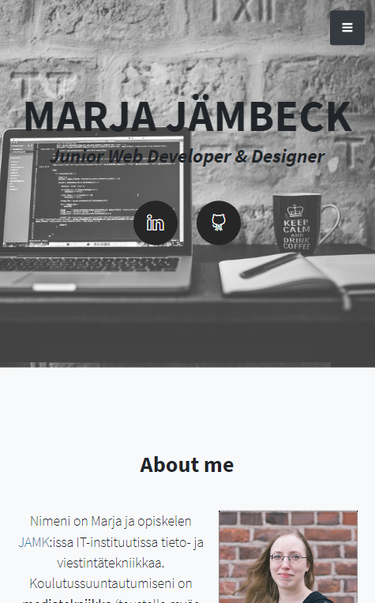

# Harjoitustyö  
## Web-portfolion päivitys

Alkuperäinen portfolioni (https://sekuretto.github.io/) kaipasi päivitystä, joten otin sen harjoitustyöni aiheeksi. Olen toteuttanut aiemman portfolio-sivun myös Bootstrapilla, mutta käyttäen valmista, ilmaista Bootstrap portfolio teemaa (https://startbootstrap.com/theme/stylish-portfolio), jonka rakennetta olen vain muokannut ja lisännyt sivulle oman sisällön. Halusin tässä harjoitustyössä korvata tämän vanhan portfolion, ja oman oppimisen kannalta luoda sivupohjan Bootstrapilla ihan itse. Sivun sisällön ja kokonaisrakenteen pidin kuitenkin pääosin samana kuin aiemmassa portfoliossa. Olen tähän asti pitänyt myös käyttämäni teeman sivurakenteesta, joten halusin mukailla ja matkia sitä myös nyt sivua uusiessani. Mutta nyt harjoitustyön yhteydessä aioin ja pystyin pohtimaan paremmin sivuston eri osien rakennetta, visuaalisuutta ja toimivuutta; erityisesti tiettyjen sivu-osioiden ulkonäköä ja toimivuutta.  

  

Alkuperäisen portfolioni lähdekoodi on nähtävissä [Githubin repositoriossani](https://github.com/sekuretto/sekuretto.github.io).  

## Resursointi (ajankäyttö)

Websivun koko rakenteen suunnitteluun ja sisältöön minun ei juuri tarvinnut käyttää aikaa, koska tosiaan hyödynsin pohjana jo nykyistä portfoliotani. Käytin kuitenkin Figmaa, sekä Web-visualisointi -kurssin WV-H7 ja WV-H10-tehtäviä hyödykseni pohtiessani mitä muutoksia tekisin sivun rakenteeseen tai ulkonäköön.  

Aloitus 18.2.2021 ->  lopetus ?.3.2021  

## Teknologiavalinnat perusteluineen

### Bootstrap
Käytin harjoitustyössä Bootstrapin uusinta versiota (v5.0.0-beta2). Uusimman version käyttäminen tarkoitti totta kai, että minulla oli käytettävissäni uusin Bootstrapin dokumentaatio sivujen rakentamisen apuna, ja sivut pysyvät myös pitempään yhteensopivina ja vakaina.  

### Flexbox/Grid  

Hyödynsin Flexboxia ja Gridiä tarpeen mukaan.

### Selaintuki & skaalautuvuus

Bootstrap v5 ei tue Internet Explorer-selainta, mutta tukee IE:n korvaavaa Edgeä. Koska IE on tosiaan vähitellen poistumassa historiaan, eikä sen käyttöä enää edes suositella, totesin tämän harjoitustyön kannaltakin että selaintuki IE:lle ei enää ole tarpeellinen.  

Bootstrap v5 tukee mobiilissa Androidin osalta Chromea, Firefoxia ja Android-selainta/WebViewtä. Desktopissa tukee Windowsin osalta Chromea, Firefoxia, Microsoft Edgeä ja Operaa. Koin että jos huolehdin skaalautuvuudesta ja selaintuesta ainakin näille selaimille ja alustoille, erityisesti Chromelle, Firefoxille ja Edgelle sekä mobile-versiona Androidille, se olisi riittävä selaintuen laajuus.

https://getbootstrap.com/docs/5.0/getting-started/browsers-devices/  

Pyrin suunnittelemaan sivut mobile first-periaatteella siten, että sivut skaalautuvat ja CSS on suunniteltu ensisijaisesti mobiililaitteen ruuduille. Käytän media queryjä CSS:ssä skaalaamaan sivut sitten isommille näytöille.  

Pyrin siis ottamaan Bootstrapin elementteineen työhöni mukaan jo alusta asti, ja rakensin sivujen perusrakenteen sillä. Omalla CSS:llä lähdin sitten muokkaamaan Bootstrapin elementtejä niiltä osin kuin tarvetta ilmeni, ja lisäsin myös omaa toiminnallisuutta elementteihin. Lisäksi hyödynsin Bootstrapin omia tyylejä ja classeja omien sivuelementtieni tyylien pohjana, millä tavoin sain vähennettyä kirjoitettavan CSS:n määrää. Mikä osaltaan taas vähensi päällekkäisten tyylimääritysten määrää ja selaimen turhaa tyylien ylikirjoittamista. 

### Git (pages) / Github  

Sivut on harjoitustyönä toteutettu JAMK Gitlabiin, josta niitä voi Pagesin avulla käyttää suoraan verkkosivuna. Sivujen toteutukseen käytin Git-versionhallintaa suoraan konsolista ja koodin sekä dokumentaation kirjoittamiseen käytin Visual Studio Codea.  

Päivitin lopuksi uudet sivut myös Githubiin entisen version tilalle.  

### SASS  

Visual Studio Coden extensioneina minulla on mm. Live Server sekä Live Sass Compiler Sassin kääntämiseen.

Päätin pyrkiä käyttämään Sassia harjoitustyössä harjoitellakseni lisää sen käyttöä.

- CSS animointi
- visuaalisuus (kuvat, animaatio, typografia, Google Material Design)
- hyvä skaalautuvuus ja selaintuki (mobile first!)
- omaa SVG-grafiikkaa  
- visuaalisuutta ja käyttöliittymäsuunnittelua mietitty  
- optimointi:  https://developers.google.com/speed/pagespeed/  
- raportoinnissa opiskelija osaa vertailla ja perustella valintojansa

### Visuaalisuus ja siihen liittyvät valinnat perusteluineen  

Erityisesti vanhan portfolioni Skills-, ja Portfolio-osiot kaipasivat mielestäni muutosta. Halusin lisätä Skills-osioon kullekin teknologia-osaamiseni osa-alueelle jonkinlaisen näkyvän mittarin taitoni vahvuudesta, jotta käyttäessäni sivujani työnhaussa ja mahdollinen työnantaja vierailee sivuillani hän saisi jo nopealla vilkaisulla kuvan taidoistani. Visuaalisesti selkein vaihtoehto tällaiselle mittarille oli mielestäni jonkinlainen 1-5 arvosanan skaala, esim. 1-5 tähteä riippuen taidon määrästä. Vaihtoehtona mietin myös progress-barien käyttöä tällaisena mittarina.  

https://www.w3schools.com/howto/howto_css_hero_image.asp  

### Pagespeed

Testasin alkuperäisen portfolion Pagespeed-tulokset:  
pagespeed_original_desktop.png  
pagespeed_original_mobile.png  

Pyrin harjoitustyössäni parantamaan tuloksia. Varsinkin mobile-version tulosta oli parannettava. Rehellisesti en alkuperäisen websivun luomisen yhteydessä ollut lainkaan tullut pohtineeksi sivujen toimivuutta tai kuvatiedostojen kokoa nopeuden kannalta, joten nyt oli harjoitustyössä hyvä tilaisuus siihenkin. Mobiiliversio kaipasi tuloksen perusteella erityisesti juuri grafiikan optimointia ja ylimääräisen koodin siivousta.

## Yleisiä mietteitä työn kulusta ja mitä tuli opittua

Opin ehdottomasti parempaa ymmärrystä Bootstrapin käytöstä.

https://getbootstrap.com/docs/5.0/getting-started/browsers-devices/

Aikataulutustani olisin sikäli voinut parantaa, että harjoitustyöni teko ja sen myötä kurssisuoritukseni myöhästyi aika roimasti suunnitellusta.

Aikataulu:  
etukäteen Figma-mallia ja Bootstrapin testailua sivun header-rakenteeseen  
Aloitus 18.2.2021 ->  lopetus ?.3.2021  

## Arvosanaehdotus itselle perusteluineen